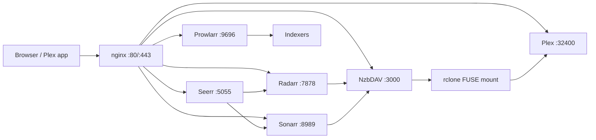

# Stack architecture

The Bear Cave is a single-host, LAN-oriented media stack on the private
`bearcave` network. nginx is the internal TLS ingress and routes subdomains to
current services, while direct host ports remain published as the rollback path.
Plex remains on host networking for GDM/DLNA/remote access.

## System overview

### Content flow

1. nginx terminates internal TLS and selects a service by `*.rawrz.lan` host.
2. Seerr creates movie and TV requests in Radarr or Sonarr.
3. Prowlarr supplies indexers to Radarr and Sonarr.
4. Radarr/Sonarr submit NZBs to NzbDAV through its SABnzbd-compatible API.
5. NzbDAV exposes completed content through WebDAV.
6. `nzbdav_rclone` mounts that tree through FUSE; Plex consumes the media links.

## Network topology

| Network | Services | Purpose |
|---------|----------|---------|
| `bearcave` bridge | nginx and bridge services | Internal DNS, routing, and service-to-service traffic |
| `host` | Plex | GDM, DLNA, remote-access negotiation, and direct `:32400` access |

nginx publishes `80` and `443` by default. Set `NGINX_HTTP_PORT` and
`NGINX_HTTPS_PORT` for side-by-side validation. Application ports remain published
during migration and are the documented bypass/rollback path:

| Port | Service |
|------|---------|
| 3000 | NzbDAV |
| 5055 | Seerr |
| 7878 | Radarr |
| 8989 | Sonarr |
| 9696 | Prowlarr |
| 32400 | Plex |

## TLS and hostnames

`services/nginx/generate-cert.sh` creates an uncommitted LAN CA and SAN certificate
under `config/nginx/certs`. Trust `rawrz-ca.crt` on client devices, resolve the
`*.rawrz.lan` names to the stack host, and use the ingress acceptance script before
cutting over any client bookmarks.

## FUSE lifecycle

`nzbdav_rclone` is the mount owner. Radarr, Sonarr, Plex, and Unpackerr use the
shared mount and are health-gated. Confirm the mount before rescans and never
force-unmount it while consumers are running.

## Operational surface

The supported operator surface is Docker Compose, `services/nginx/test-ingress.sh`,
the scripts under `scripts/`, the health checks under `tests/health/`, and the bash
functions under `services/bash-functions/`. Direct application ports remain an
intentional rollback path until the later migration milestone.
